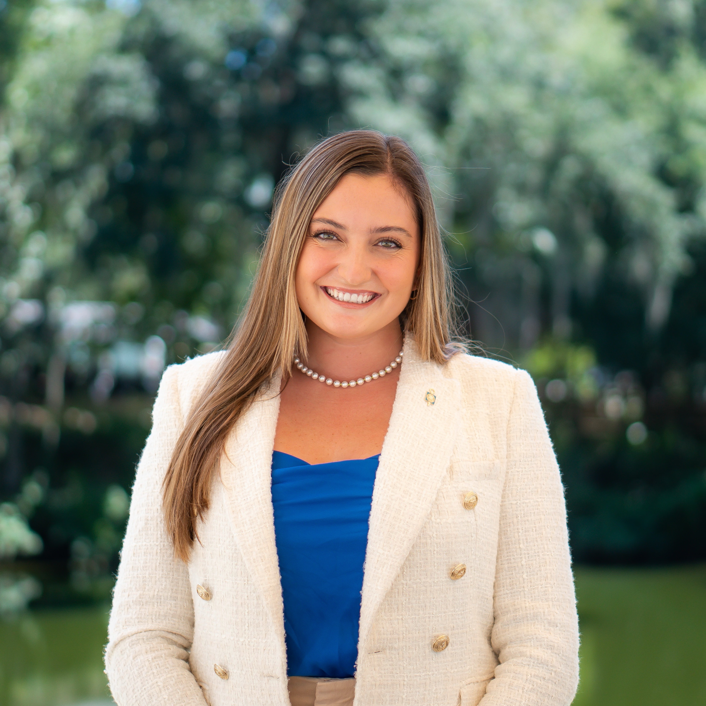

# m1-hw1-jadelyn-fleischer-
# My First Coding Assignment #

## About Me ##
Jadelyn Fleischer is a fourth-year Mass Communications student at the University of Florida from Jacksonville, Florida. She completed her Advertising and Women's Studies degrees also from UF this past August. She is planning on attending law school next year to study mass communications law. In her free time, she likes to run, cook, and go to the beach.
## Past Coding Experience ##
She has no prior experience in coding, but she is very excited to learn more.
## Career Goals ##
1. Mass Communications Attorney
2. Civil Rights Attorney
3. Sports and Entertainment Attorney